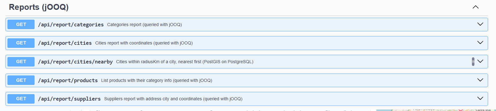
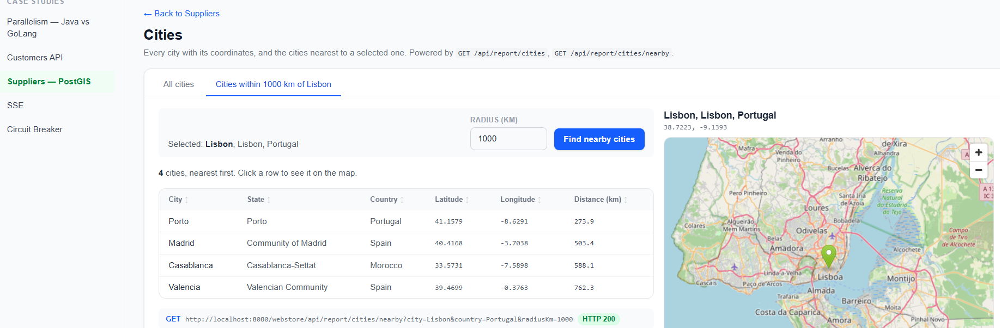

# ReportController — jOOQ + PostGIS reports

`ReportController` (`/api/report`, Swagger tag **Reports (jOOQ)**) exposes **read-only reporting queries**.
Unlike the Catalog and Cart modules (JPA), every query here is written with **jOOQ** against the same
PostgreSQL database, and the geospatial one delegates the math to **PostGIS**.

The application runs under the context path `/webstore`, so the full URL is
`http://localhost:8080/webstore/api/report/...`.



| Method | Path | Description |
|---|---|---|
| GET | `/api/report/categories` | Categories report |
| GET | `/api/report/products` | Products with their category |
| GET | `/api/report/suppliers` | Suppliers with address city, coordinates and product count |
| GET | `/api/report/cities` | All cities with coordinates |
| GET | `/api/report/cities/nearby` | **Cities within X km of a city, nearest first** (PostGIS) |

The rest of this document focuses on `/cities/nearby`.

---

## `GET /api/report/cities/nearby`

Finds every city within a radius of a reference city.

| Param | Required | Description |
|---|---|---|
| `city` | yes | Name of the reference city (case-insensitive) |
| `country` | no | Only needed when the city name is ambiguous (e.g. several cities share the name) |
| `radiusKm` | yes | Search radius in kilometers, must be `> 0` |

```
GET /webstore/api/report/cities/nearby?city=Lisbon&country=Portugal&radiusKm=1000
```

```json
[
  { "id": "…", "name": "Porto",     "state": "Porto",              "country": "Portugal", "latitude": 41.1579, "longitude": -8.6291, "distanceKm": 273.9 },
  { "id": "…", "name": "Madrid",    "state": "Community of Madrid", "country": "Spain",    "latitude": 40.4168, "longitude": -3.7038, "distanceKm": 503.4 },
  { "id": "…", "name": "Casablanca","state": "Casablanca-Settat",   "country": "Morocco",  "latitude": 33.5731, "longitude": -7.5898, "distanceKm": 588.1 },
  { "id": "…", "name": "Valencia",  "state": "Valencian Community", "country": "Spain",    "latitude": 39.4699, "longitude": -0.3763, "distanceKm": 762.3 }
]
```

The reference city is excluded and results are ordered by distance, nearest first. `distanceKm` is rounded to 0.1 km.

| Situation | Result |
|---|---|
| City not found | `ResourceNotFoundException` (404) |
| Name matches more than one city | `BusinessRuleException` asking for `country` |
| `radiusKm` ≤ 0 (or missing/NaN) | `BusinessRuleException` |
| Not running on PostgreSQL (e.g. H2 dev profile) | `BusinessRuleException`: requires PostgreSQL with PostGIS |

### Demo — portfolio UI

The portfolio front end consumes this endpoint at **`/case-studies/suppliers/cities`**
(menu: *Case studies → Suppliers — PostGIS*). The **Cities** page has two tabs: *All cities*
(`GET /api/report/cities`) and *Cities within N km of …* (`GET /api/report/cities/nearby`), which lists the
cities around the selected one, nearest first, and marks it on a map:



Front-end source: [`CitiesPage.tsx`](https://github.com/mariosergio-portfolio/portfolio-frontend/blob/main/src/pages/case-studies/CitiesPage.tsx)
in the [portfolio-frontend](https://github.com/mariosergio-portfolio/portfolio-frontend) repository
(route `suppliers/cities` in `src/router/index.tsx`).

---

## How it works

### Request flow (hexagonal)

```
ReportController            infrastructure/rest/report      GET /cities/nearby → CityDistanceResponse
   └─ ReportPort            application/port/in             listCitiesWithinKm(city, country, radiusKm)
       └─ ReportPortImpl    application/service             validates radius, resolves the origin city
           └─ ReportQueryRepository   application/port/out   findCitiesByName / findCitiesWithinKm
               └─ ReportJooqQueryAdapterImpl  infrastructure/persistence/adapter   jOOQ + PostGIS SQL
```

The service resolves the `city`/`country` params to a single origin city (404 / ambiguity errors),
then hands the **origin id** to the adapter. All distance work happens in the database.

### The data: `cities.location`

```sql
CREATE EXTENSION IF NOT EXISTS postgis;

CREATE TABLE cities (
    id        UUID PRIMARY KEY,
    name      VARCHAR(255) NOT NULL,
    state     VARCHAR(100),
    country   VARCHAR(100) NOT NULL,
    location  public.GEOMETRY(Point, 4326) NOT NULL   -- longitude/latitude (WGS 84)
);

CREATE INDEX idx_cities_location ON cities USING GIST (location);
```

(migration `db/vendor/postgresql/V5__create_cities_and_suppliers.sql`; the seed has 100 cities.)

### The query

`ReportJooqQueryAdapterImpl.findCitiesWithinKm` is a **self-join**: `co` is the origin city, `ci` each candidate.
It is equivalent to:

```sql
SELECT ci.id, ci.name, ci.state, ci.country,
       public.ST_AsText(ci.location),
       public.ST_Distance(co.location::public.geography, ci.location::public.geography) / 1000.0 AS distance_km
FROM cities co
JOIN cities ci
  ON ci.id <> co.id
 AND public.ST_DWithin(co.location::public.geography, ci.location::public.geography, :radiusKm * 1000)
WHERE co.id = :originId
ORDER BY distance_km;
```

Filtering, distance and ordering are all done by PostGIS — no distance math in Java — and the origin's
geometry never leaves the database.

### PostGIS concepts used

| Piece | Why |
|---|---|
| `GEOMETRY(Point, 4326)` | Column type. **SRID 4326 = WGS 84**, the GPS system: coordinates are degrees, in `(longitude, latitude)` order |
| `ST_SetSRID(ST_MakePoint(lon, lat), 4326)` | Used by the seed. `ST_MakePoint` creates a point with no SRID; `ST_SetSRID` only *labels* it (it does not reproject, `ST_Transform` does that) |
| `::geography` cast | Treats the degrees as positions on the Earth spheroid, so distances are **in meters**. On plain `geometry`, `ST_Distance` would return degrees, which is meaningless as a distance |
| `ST_Distance` | Geodesic distance in meters, divided by 1000 for km |
| `ST_DWithin` | Boolean "within N meters" filter |
| `ST_AsText` | Reads the point back as WKT (`POINT(lon lat)`); the adapter parses it into latitude/longitude |
| `public.` prefix | The datasource uses `currentSchema=webstore`, so `search_path` does not include `public` where PostGIS is installed |

> **Index note:** the GIST index is on the `geometry` column, while the query filters on `ci.location::geography`.
> With 100 rows this is irrelevant; for large tables add an expression index
> `CREATE INDEX ... ON cities USING GIST ((location::geography));` and confirm with `EXPLAIN`.

### How jOOQ is used

jOOQ is on the classpath through `spring-boot-starter-jooq`; Spring Boot provides the `DSLContext`
bean on top of the application's `DataSource`, so jOOQ queries share the connection pool and the
transaction of the service (`@Transactional(readOnly = true)` on `ReportPortImpl`).

There is **no jOOQ code generation** in this project. Tables and columns are declared as plain-SQL fragments:

```java
private static final Table<?>       CITIES  = table("cities ci");
private static final Field<UUID>    CI_ID   = field("ci.id", UUID.class);
private static final Field<String>  CI_NAME = field("ci.name", String.class);
```

PostGIS has no typed jOOQ equivalent without extra modules, so the spatial parts are plain-SQL templates
with **bind parameters** (`{0}` placeholders), never string concatenation of user input:

```java
Field<Double> distanceKm = field(
        "public.ST_Distance(co.location::public.geography, ci.location::public.geography) / 1000.0",
        Double.class);
Condition within = condition(
        "public.ST_DWithin(co.location::public.geography, ci.location::public.geography, {0})",
        val(radiusKm * 1000.0));

dsl.select(CI_ID, CI_NAME, CI_STATE, CI_COUNTRY, location, distanceKm)
   .from(table("cities co"))
   .join(CITIES).on(CI_ID.ne(field("co.id", UUID.class)).and(within))
   .where(field("co.id", UUID.class).eq(origin.id()))
   .orderBy(distanceKm)
   .fetch(r -> new CityDistance(toCity(r, location), r.get(distanceKm)));
```

Rows are mapped straight to the domain read models (`City`, `CityDistance` records) in the `fetch` lambda.
The adapter checks `dsl.dialect().family()` and refuses to run the nearby search outside PostgreSQL.

---

## Try it

1. Run PostgreSQL with the **PostGIS** extension available (e.g. the `postgis/postgis` Docker image) and start the app with the `postgres` profile.
2. Open Swagger UI: `http://localhost:8080/webstore/swagger-ui.html` → **Reports (jOOQ)** → `GET /api/report/cities/nearby`.
3. Or call it directly:

```bash
curl "http://localhost:8080/webstore/api/report/cities/nearby?city=Berlin&radiusKm=600"
```
