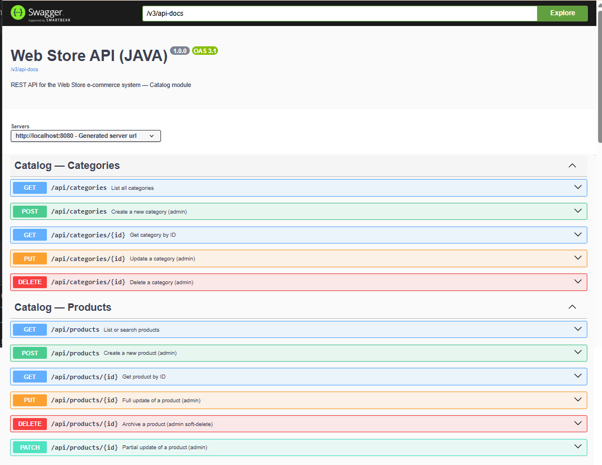
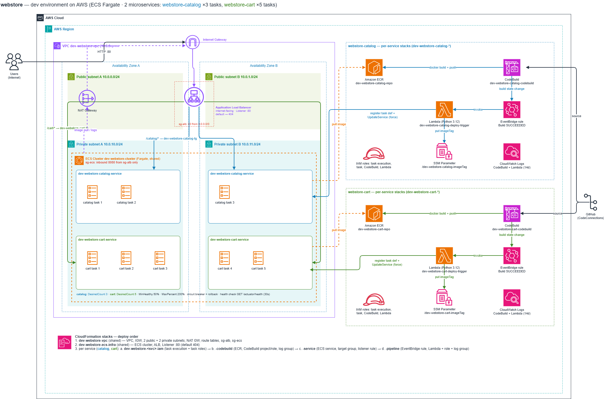

# Webstore REST API (Java / Spring)

Web Store REST API — **Catalog module** (Products + Categories), built with **Java 25 / Spring Boot 4.1** following **Hexagonal Architecture (Ports & Adapters)**.

- Group/Artifact: `com.mycompany` / `webstore-java`
- Base package: `com.mycompany.webstore`
- GitHub: https://github.com/mariosergio30/webstore-java-api

---

Swagger UI: `http://localhost:8080/swagger-ui.html`

---

## Architecture: Hexagonal (Ports & Adapters)

Requests flow **in** through a driving adapter (REST controller), cross an **input port**
into the application core, and any persistence need flows **out** through an **output port**
to a driven adapter (JPA). The domain model at the center has zero framework dependencies —
no Spring, no JPA, no Lombok.

```
                              ┌─────────────────────────────┐
                              │      HTTP client / caller    │
                              └───────────────┬───────────────┘
                                              │ JSON
                                              ▼
                              ┌─────────────────────────────┐
   DRIVING ADAPTER            │      ProductController       │  infrastructure/rest/catalog
   (infrastructure/rest)      │  (ProductRequest/Response,   │
                              │   ProductRestMapper)         │
                              └───────────────┬───────────────┘
                                              │ implements
                                              ▼
   INPUT PORT                  ┌─────────────────────────────┐
   (application/port/in)       │      ProductPort  (interface)│  application/port/in
                              └───────────────┬───────────────┘
                                              │
                                              ▼
   APPLICATION SERVICE         ┌─────────────────────────────┐
   (application/service)       │      ProductPortImpl         │  business rules,
                              │  (use cases, validations)    │  UUIDs, timestamps
                              └───────────────┬───────────────┘
                                              │ depends on
                                              ▼
   DOMAIN MODEL                 ┌─────────────────────────────┐
   (domain/model)              │   Product / Category          │  plain Java,
                              │   (archive(), isActive()...)  │  no framework deps
                              └───────────────┬───────────────┘
                                              │ persisted via
                                              ▼
   OUTPUT PORT                  ┌─────────────────────────────┐
   (application/port/out)       │   ProductRepository (interface)│ application/port/out
                              └───────────────┬───────────────┘
                                              │ implements
                                              ▼
   DRIVEN ADAPTER                ┌─────────────────────────────┐
   (infrastructure/persistence) │ ProductPersistenceAdapterImpl │
                              │ (ProductPersistenceMapper)    │
                              └───────────────┬───────────────┘
                                              │ Domain ↔ JPA entity
                                              ▼
                              ┌─────────────────────────────┐
                              │  ProductJpaRepository          │  Spring Data JPA
                              │  → ProductJpaEntity → DB       │  (H2 dev / PostgreSQL prod)
                              └─────────────────────────────┘
```

**Rules enforced across the codebase:**

- Domain objects (`domain/model/`) never depend on Spring, JPA, or Lombok.
- Application services depend only on port interfaces and domain objects — never on JPA entities or HTTP types.
- JPA entities live exclusively in `infrastructure/persistence/entity/` and never cross into domain/application.
- A `RestMapper` and a `PersistenceMapper` (both MapStruct, `componentModel = "spring"`) sit at each boundary.
- Controllers inject the **input port interface**, never the service implementation directly.

---

### REST API


---
Base path: `/api`

| Method | Path | Description |
|---|---|---|
| GET | `/api/products` | List/search (`q`, `categoryId`, `minPrice`, `maxPrice`, `status`, pagination) |
| GET | `/api/products/{id}` | Get by UUID |
| POST | `/api/products` | Create (status → DRAFT) |
| PUT | `/api/products/{id}` | Full update (SKU immutable) |
| PATCH | `/api/products/{id}` | Partial update (null fields skipped) |
| DELETE | `/api/products/{id}` | Archive (soft-delete) |
| GET/POST/PUT | `/api/categories[/{id}]` | Category CRUD |
| DELETE | `/api/categories/{id}` | Hard delete (blocked if products reference it) |


### Key libraries

| Library | Version | Purpose |
|---|---|---|
| Spring Boot | 4.1.0 | Framework |
| Spring Actuator | Spring Boot managed | Health, info, metrics, loggers, mappings endpoints |
| MapStruct | 1.6.3 | Compile-time object mapping at layer boundaries |
| Lombok | Spring Boot managed | `provided` scope only — used in infra layer, never in domain |
| SpringDoc OpenAPI | 2.8.9 | Swagger UI at `/swagger-ui.html`, API docs at `/v3/api-docs` |
| JJWT | 0.13.0 | JWT dependency present — not yet wired into security filter |
| Flyway | Spring Boot managed | DB migrations (prod only) |
| H2 | Spring Boot managed | In-memory DB for dev |
| PostgreSQL driver | Spring Boot managed | Production DB |
| Testcontainers BOM | 2.0.5 | Integration test containers (future use) |

### Naming conventions

| Layer | Pattern | Example |
|---|---|---|
| Input port | `XxxPort` | `ProductPort` |
| Output port | `XxxRepository` | `ProductRepository` |
| Service | `XxxPortImpl` | `ProductPortImpl` |
| Persistence adapter | `XxxPersistenceAdapterImpl` | `ProductPersistenceAdapterImpl` |
| JPA entity | `XxxJpaEntity` | `ProductJpaEntity` |
| JPA repository | `XxxJpaRepository` | `ProductJpaRepository` |
| REST mapper | `XxxRestMapper` | `ProductRestMapper` |
| Persistence mapper | `XxxPersistenceMapper` | `ProductPersistenceMapper` |

### Exception handling (RFC 9457 `ProblemDetail`)

| Exception | HTTP Status | Use when |
|---|---|---|
| `ResourceNotFoundException` | 404 | Entity not found by ID or SKU |
| `BusinessRuleException` | 422 | Domain rule violated (duplicate SKU, price ≤ 0, self-parent, etc.) |
| `MethodArgumentNotValidException` | 400 | Jakarta Bean Validation failed |


## CloudFormation

Infrastructure is split so that networking/compute is **shared once per environment**,
while each microservice (`catalog`, `cart`) owns its **own** build pipeline, auto-deploy
trigger, ECS service, target group, and SSM parameter. See
[cloudFormation/generic/aws-architecture.txt](doc/aws-architecture.txt)
for the full diagram.

```
SHARED (deployed once per environment)
  VPC stack        → VPC, subnets, IGW, NAT, security groups
  ECS-infra stack  → ECS Cluster + Application Load Balancer + Listener

PER SERVICE (deployed once per microservice: catalog, cart)
  IAM stack        → ECS task execution role + task role
  CodeBuild stack  → ECR repo + CodeBuild project (GitHub → Docker → ECR)
  Pipeline stack   → EventBridge + Lambda: auto-redeploys ECS on build success
  ECS-service stack→ ECS Service + Target Group + ALB path rule (/<service>/*)
  SSM Parameter    → /<env>-webstore-<service>-imageTag
```

```
CodeBuild (per service) → ECR (per service)
        │ on SUCCEEDED
        ▼
EventBridge → Lambda (per service) → ECS Service (per service, shared cluster)
                                            │
                                            ▼
                              Target Group (per service) ← ALB (shared) ← internet
                              
```

**Deploy order:** VPC → ECS-infra → *for each service:* IAM → CodeBuild → ECS-service → Pipeline.

Current active stacks live under `cloudFormation/ecs-simple/` (single-service). The
multi-service-ready templates referenced above live under `cloudFormation/generic/per-service/`.





## Quick start

```bash
# Build (skip tests)
mvn -B package -DskipTests

# Run tests
mvn test

# Run the application (dev profile — H2 in-memory, no Flyway)
mvn spring-boot:run
```